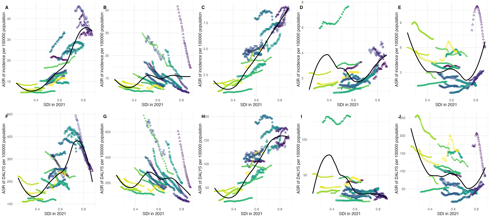

# Global Burden of Gastrointestinal Cancers

**GBD-based epidemiological analysis of major gastrointestinal cancers using burden metrics, EAPC trends, SDI comparisons, age-group analysis, geographic visualization, and exploratory forecasting.**

## Project Snapshot

This project was developed for a statistical modeling competition and examines the global burden of five major gastrointestinal cancers:

- gastric cancer
- liver cancer
- colorectal cancer
- pancreatic cancer
- oral cancer

The analysis uses Global Burden of Disease (GBD) data to compare incidence, mortality and disability-adjusted life years (DALYs) across time, geography and levels of socioeconomic development.

**Core question:** how do the magnitude and long-term trends of gastrointestinal cancer burden differ across diseases, regions, age groups and SDI levels?

---

## Analytical Framework

The project combines several epidemiological perspectives rather than relying on a single summary metric.

### 1. Burden measurement

- incidence
- mortality
- DALYs
- age-standardized rates (ASR)

### 2. Temporal trends

Estimated Annual Percentage Change (**EAPC**) is used to summarize long-term changes in age-standardized rates and compare whether disease burden is increasing or decreasing across locations and cancer types.

### 3. Socioeconomic gradient

The relationship between the **Socio-demographic Index (SDI)** and cancer burden is examined using cross-location comparisons and visual trend analysis.

### 4. Population heterogeneity

Age-group analyses explore how disease burden differs across demographic strata rather than assuming the global population is homogeneous.

### 5. Geographic distribution

Country-level maps visualize spatial differences in disease burden and EAPC.

### 6. Exploratory forecasting

ARIMA models were explored as an additional forecasting exercise. Forecasts should be interpreted as exploratory statistical projections rather than causal or policy predictions.

---

## My Role

I contributed to the statistical-analysis workflow in R, including:

- preprocessing and integrating multi-disease GBD datasets;
- standardizing disease and indicator structures for downstream analysis;
- implementing EAPC calculations and confidence intervals;
- analyzing SDI–burden relationships;
- building age-group and subgroup analyses;
- producing geographic and comparative visualizations;
- organizing scripts and outputs into a reproducible project repository.

This repository preserves the analytical workflow and selected outputs rather than attempting to reproduce the full competition report verbatim.

---

## Representative Outputs

### Cross-disease comparison



The repository also contains:

- ASR / EAPC comparison figures;
- SDI–ASR visualizations;
- country-level maps;
- age-group disparity outputs;
- disease-composition plots.

See [`outcome/`](outcome/) for the generated figures.

> **Results boundary:** the current public repository demonstrates the analytical workflow and visualization outputs. Specific numerical headline conclusions should be taken from the final validated competition report rather than inferred from plots alone. This README intentionally avoids inventing or over-interpreting results that have not been independently re-checked.

---

## Key Methods

| Component | Method / output |
| --- | --- |
| Disease burden | Incidence, mortality, DALYs, ASR |
| Long-term trend | EAPC with confidence intervals |
| Development gradient | SDI–ASR / SDI–burden comparisons |
| Demographic heterogeneity | Age-group and subgroup analysis |
| Spatial epidemiology | Country-level geographic visualization |
| Exploratory projection | ARIMA forecasting |

---

## Repository Structure

```text
gastrointestinal_cancer_GBD/
├── script/                  # R analysis scripts
├── outcome/                 # selected figures and analysis outputs
├── 统计建模大赛.Rproj         # R project file
└── README.md
```

### Main scripts

| Script | Purpose |
| --- | --- |
| `data_preprocessing.r` | clean and reshape raw GBD files |
| `merge_datasets.R` | integrate cancer-specific datasets |
| `eapc_functions.R` | calculate EAPC and confidence intervals |
| `sdi_incidence_correlation.R` | examine SDI and burden relationships |
| `map_visualization.R` / `map_all.R` | geographic visualization |
| `age_group_analysis.R` | age-group comparisons |
| `disease_proportion.R` | disease-composition analysis |
| `arima_forecast.r` | exploratory time-series forecasting |

Additional scripts in [`script/`](script/) support disease-specific summaries, tables and visualization workflows.

---

## Technical Stack

**R** · `dplyr` · `ggplot2` · `sf` · `maps` · `patchwork` · `cowplot` · epidemiological trend analysis · geographic visualization

---

## Reproducibility Notes

The original competition workflow was developed iteratively, so some scripts contain project-specific assumptions and may require path or input-file adjustments before rerunning on a new machine.

A production-grade next version would:

1. replace remaining hard-coded paths with project-relative paths;
2. define package dependencies explicitly (for example with `renv`);
3. consolidate repeated scripts into reusable functions;
4. create a single reproducible entry pipeline;
5. link each headline result to a verified figure / table and source dataset.

---

## What This Project Demonstrates

- epidemiological thinking beyond a single model or metric;
- experience working with large multi-dimensional public-health datasets;
- trend analysis and interpretation using EAPC;
- subgroup, socioeconomic and geographic perspectives;
- R-based data wrangling and visualization;
- translating a broad public-health question into a structured analysis workflow.

---

## Status

**Public case-study status:** usable and representative, with one remaining upgrade: re-check the final competition report and add 2–3 verified numerical headline findings with their corresponding figures/tables.

Until that verification is complete, the repository should be presented as a strong **epidemiology / GBD analysis workflow**, not as a source of definitive global cancer-burden conclusions.

---

**Yixin Chen (Cathy)**  
Applied Statistics / Biostatistics · Southern Medical University
